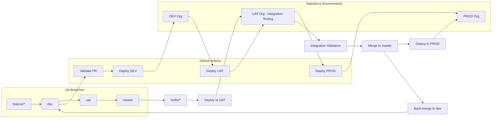
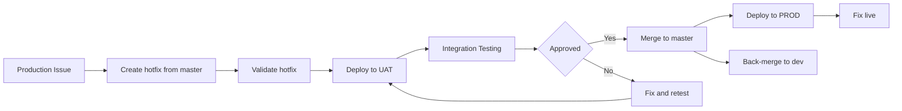
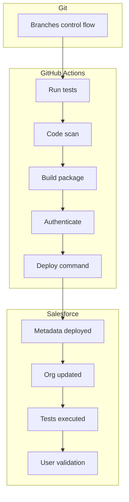
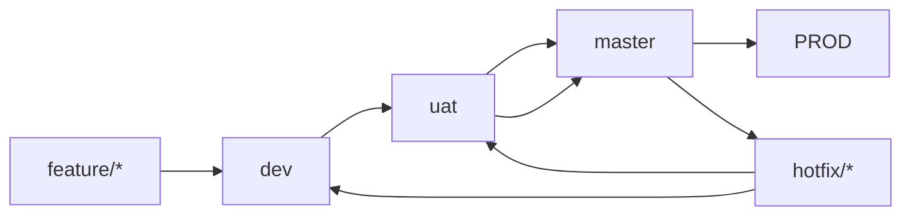

# Salesforce Deployment Flow (Dev → UAT → Prod + Hotfix)

## 🧩 Full Architecture

---

## 🔁 Normal Release Flow

```mermaid
flowchart LR

A[feature branch] --> B[PR to dev]
B --> C[Validate PR]
C --> D[Deploy to DEV]
D --> E[DEV Testing]

E --> F[Merge dev to uat]
F --> G[Deploy to UAT]
G --> H[UAT Integration and Signoff]

H --> I[Merge uat to master]
I --> J[Deploy to PROD]
J --> K[Post-release validation]
```

---

## 🚑 Hotfix Flow (via UAT)

---

## ⚖️ GitHub Actions vs Salesforce

---

## 🧱 Branch Strategy

