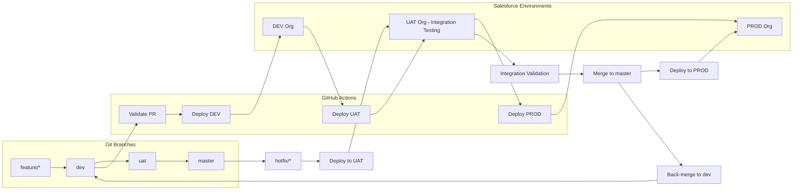
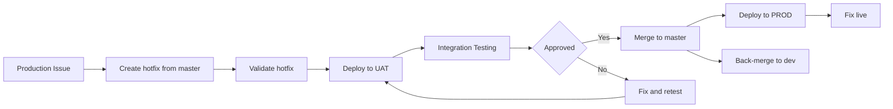
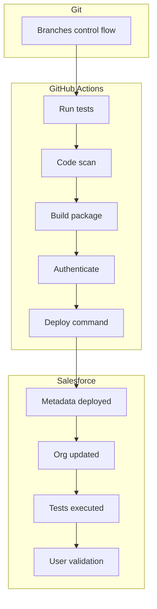
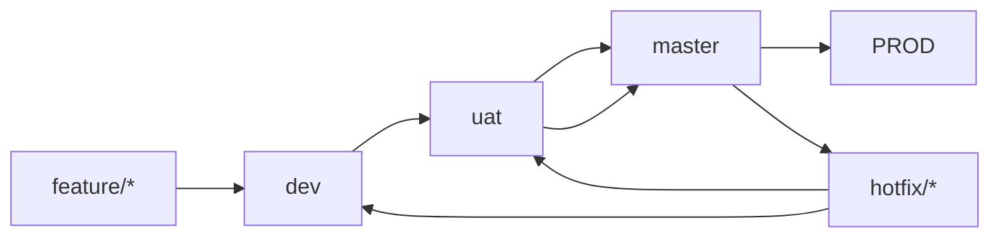

# Salesforce Deployment Flow (Dev → UAT → Prod + Hotfix)

## 🧩 Full Architecture



---

## 🔁 Normal Release Flow

```mermaid
flowchart LR

A[feature branch] --> B[PR to dev]
B --> C[Validate PR]
C --> D[Deploy to DEV]
D --> E[DEV Testing]

E --> F[Merge dev to uat]
F --> G[Deploy to UAT]
G --> H[UAT Integration and Signoff]

H --> I[Merge uat to master]
I --> J[Deploy to PROD]
J --> K[Post-release validation]
```



---

## 🚑 Hotfix Flow (via UAT)



---

## ⚖️ GitHub Actions vs Salesforce



---

## 🧱 Branch Strategy




# Salesforce CI/CD Pipeline Setup Using GitHub Actions

 1. Overview
    
    This document describes the setup of a CI/CD pipeline for Salesforce environments using Git and GitHub Actions. The pipeline automates testing, validation, and deployment of metadata across multiple environments.
    
    The process ensures:
    
    * Controlled development through branching
    * Automated quality checks
    * Reliable deployments to Salesforce orgs

---
2. Architecture Overview

    # Pipeline Flow
    
    The pipeline consists of three main layers:
    
    1. Git (Source Control)
    
       * Manages branches and code history
       * Controls flow of changes between environments
    
    2. GitHub Actions (CI/CD Engine)
    
       * Runs automation workflows
       * Executes validation and deployment steps
    
    3. Salesforce (Target Platform)
    
       * Receives metadata deployments
       * Executes tests and validations
       * Target environments (Dev, UAT, Prod)

---

 3. GitHub Actions Pipeline Steps

      Each push or pull request triggers the following workflow:

     3.1 Run Tests
    
      * Executes unit tests
      * Ensures code quality before deployment
    
     3.2 Code Scan
    
      * Static code analysis
      * Detects vulnerabilities and bad practices
    
     3.3 Build Package
    
      * Prepares metadata for deployment
      * Creates deployable artifact
    
     3.4 Authenticate
    
      * Authenticates to Salesforce org using secure credentials
      * Typically uses JWT or OAuth-based authentication
    
     3.5 Deploy Command
    
      * Deploys metadata to the target Salesforce org
      * Can be validation-only or full deployment

---

 4. Salesforce Deployment Flow

      Once deployment is triggered:
    
    4.1 Metadata Deployed
    
      * Metadata is pushed to the org
    
    4.2 Org Updated
    
      * Changes are applied to the environment
    
     4.3 Tests Executed
    
      * Apex tests are run (depending on deployment level)
    
    4.4 User Validation
    
      * Manual or automated validation by users or QA team

---

 5. Branching Strategy

    The following branching model is used:
    
    5.1 Feature Branches
    
      * Naming: `feature/*`
      * Used for new development
      * Created from `dev`
      
     5.2 Development (dev)
    
      * Integration branch for features
      * Continuous deployment to Dev environment
    
     5.3 UAT Branch
    
      * Represents User Acceptance Testing environment
      * Receives stable builds from `dev`
      
     5.4 Master Branch
    
      * Represents production-ready code
      * Only tested and approved code is merged here
    
     5.5 Production (PROD)
    
      * Deployment target from `master`
    
     5.6 Hotfix Branches
    
      * Created from `master`
      * Used for urgent production fixes
      * Merged back into `master` and `dev`
   
 6. Deployment Per Branch (Process Flow)

     Feature Branch → Dev
    
    Trigger: Pull Request to `dev`
    
    * Validate deployment (dry-run)
    * Run tests
    * No real deployment
    
    ---
    
     Dev → Dev Org
    
    Trigger: Merge to `dev`
    
    * Full deployment to Dev org
    * Run tests
    * Continuous integration environment
    
    ---
    
     Dev → UAT
    
    Trigger: Merge `dev` → `uat`
    
    * Validate first
    * Deploy to UAT org
    * Run full test suite
    * QA begins validation
    
    ---
    
     UAT → Production
    
    Trigger: Merge `uat` → `master`
    
    * Validation deployment first
    * Manual approval (recommended)
    * Production deployment
    
    ---
    
     Hotfix Flow
    
    Trigger: `hotfix/*` → `master`
    
    * Fast-track validation
    * Deploy directly to Production
    * Back-merge into `dev`


---

7. Detailed Deployment Workflow

    Each pipeline execution (triggered by PR or merge) follows a structured sequence:
    
     **Step 1: Checkout Code**
    
    * GitHub Action pulls the repository
    * Uses `actions/checkout`
    
    ** Step 2: Setup Environment**
    
    * Install Salesforce CLI (`sf`)
    * Install dependencies (Node, plugins if needed)
    
    Example:
    
    ```bash
    npm install --global @salesforce/cli
    ```
  **Step 3: Authenticate to Salesforce**
  
  Authentication is done using JWT (recommended for CI/CD):
  
  ```bash
  sf org login jwt \
    --client-id $CLIENT_ID \
    --jwt-key-file server.key \
    --username $SF_USERNAME \
    --instance-url https://login.salesforce.com
  ```
  
  Requirements:
  
  * Connected App in Salesforce
  * Private key stored in repo secrets
  * Username stored in GitHub Secrets
  
  ---
  
  ** Step 4: Convert Source (if needed)**
  
  If using Metadata API format:
  
  ```bash
  sf project convert source --output-dir mdapi_output
  ```
  
  ---
  
   **Step 5: Validate Deployment (CI step)**
  
  Used for Pull Requests to prevent bad merges:
  
  ```bash
  sf project deploy start \
    --source-dir force-app \
    --target-org $SF_USERNAME \
    --test-level RunLocalTests \
    --dry-run
  ```
  
  What happens:
  
  * Metadata is checked but NOT deployed
  * Apex tests are executed
  * Failures block the PR
  
  ---
  
   **Step 6: Run Static Code Analysis**
  
  Optional but recommended:
  
  ```bash
  sf scanner run --target force-app
  ```
  
  ---
  
  ** Step 7: Build Artifact (Optional)**
  
  * Store metadata as artifact
  * Used for consistent deployments across environments
  
  ---
  
 **  Step 8: Deploy to Target Org (CD step)**
  
  Triggered on merge to branch:
  
  ```bash
  sf project deploy start \
    --source-dir force-app \
    --target-org $SF_USERNAME \
    --test-level RunLocalTests \
    --wait 30
  ```
  
  Behavior:
  
  * Metadata deployed
  * Tests executed
  * Org updated if successful
  
  ---
  
  ** Step 9: Post-Deployment Steps**
  
  * Assign permission sets
  * Run data scripts (optional)
  * Notify team (Slack/email)

---

8. Configuration Steps (Setup Guide)

     8.1 Salesforce Setup
    
        1. Create a Connected App
        
           * Enable OAuth
           * Upload certificate
           * Capture Client ID
        
        2. Create Integration User
        
           * Assign permissions
           * API access enabled
        
        3. Generate JWT Certificate
        
          ```bash
          openssl genrsa -out server.key 2048
          openssl req -new -key server.key -out server.csr
          openssl x509 -req -sha256 -days 365 -in server.csr -signkey server.key -out server.crt
          ```
          
          ---
    
     8.2 GitHub Setup
    
        Add repository secrets:
        
        * `SF_USERNAME`
        * `CLIENT_ID`
        * `JWT_KEY`
        * `SF_INSTANCE_URL`
      
      ---
    
     8.3 GitHub Actions Workflow Example
    
      ```yaml
      name: Salesforce CI/CD
      
      on:
        push:
          branches: [dev, uat, master]
        pull_request:
          branches: [dev, uat]
      
      jobs:
        deploy:
          runs-on: ubuntu-latest
      
          steps:
            - name: Checkout
              uses: actions/checkout@v3
      
            - name: Install Salesforce CLI
              run: npm install --global @salesforce/cli
      
            - name: Authenticate
              run: |
                echo "$JWT_KEY" > server.key
                sf org login jwt \
                  --client-id $CLIENT_ID \
                  --jwt-key-file server.key \
                  --username $SF_USERNAME \
                  --instance-url $SF_INSTANCE_URL
      
            - name: Validate (PR only)
              if: github.event_name == 'pull_request'
              run: |
                sf project deploy start \
                  --source-dir force-app \
                  --target-org $SF_USERNAME \
                  --test-level RunLocalTests \
                  --dry-run
      
            - name: Deploy
              if: github.event_name == 'push'
              run: |
                sf project deploy start \
                  --source-dir force-app \
                  --target-org $SF_USERNAME \
                  --test-level RunLocalTests
      ```
---
 9. Environment Mapping

| Branch    | Salesforce Environment |
| --------- | ---------------------- |
| feature/* | Scratch/Dev Org        |
| dev       | Development Org        |
| uat       | UAT Org                |
| master    | Production Org         |
| hotfix/*  | Production Org         |

---

 9. Deployment Strategy
  
  Continuous Integration (CI)
  
  * Triggered on pull requests
  * Runs tests and validation
  
   Continuous Deployment (CD)
  
  * Automatic deployment on merge
  * Environment depends on branch
  
   Validation-Only Deployments
  
  * Used before merging to higher environments
  * Ensures deployment will succeed

---

11. Security Considerations

    * Store credentials in GitHub Secrets
    * Use JWT-based authentication
    * Limit access to production branches
    * Enforce pull request reviews

---

12. Best Practices

    * Keep branches short-lived
    * Write meaningful commit messages
    * Maintain high test coverage
    * Use code reviews for all merges
    * Automate as much as possible

---

 13. Conclusion

This CI/CD setup ensures a structured and automated approach to Salesforce development. By combining Git branching strategies with GitHub Actions, teams can deliver changes faster, safer, and with higher quality.

